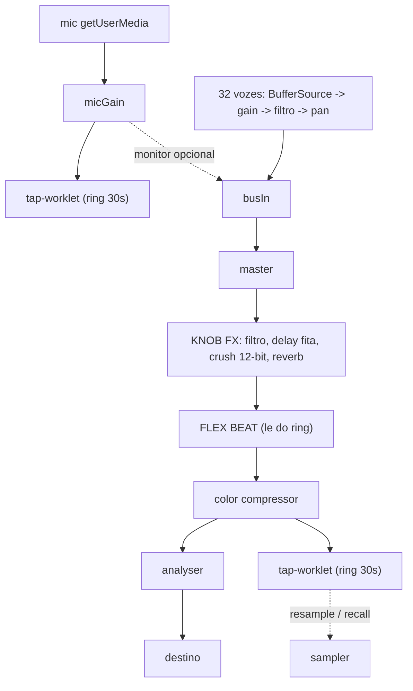

# Los Cabacitos MPC

## A ideia em uma frase

Uma caixa que grava o mundo pelo microfone do iPad, corta em 16 pads e vira música — sem login, sem arquivo, sem manual.

O kit atual é um sintetizador de teclado. Do que já existe, aproveitamos o **stack** (Web Audio, PWA, sem build), os **tokens de design**, a **cadeia de FX pós-mixagem**, o **ciclo de vida iOS** e as **regras de ouro de áudio** do [STACK.md](../../STACK.md). O teclado, as `ENGINES` e as vozes de oscilador saem inteiros.

## O que faz esse app ser memorável

Quatro decisões carregam o projeto. Todas vêm do hardware e todas cabem no jeito Teenage Engineering que o [STACK.md](../../STACK.md) já defende ("crie um modo, não a quinta fileira de controles").

- **SHIFT revela a serigrafia.** Os 16 pads têm uma segunda camada de rótulos impressa por baixo, como na foto. Segurar SHIFT repinta os pads com TRIM, CHOP, QUANTIZE, RESAMPLE, SONG, HALF SPEED. Uma superfície, dois vocabulários — nenhuma tela nova.
- **RECALL: você nunca perde a take.** Um buffer circular de 30 s guarda o tempo todo o áudio do microfone *e* cada batida de pad. Tocou algo bonito sem estar gravando? RECALL transforma os últimos 30 s em sequência (ou em sample). É o recurso mais emocional do aparelho e o mais barato de construir na web.
- **CHOP instantâneo.** Grave uma frase, toque CHOP: detecção de transiente fatia e espalha nos 16 pads. Som ambiente vira instrumento em cinco segundos. É o momento mágico que vende o app num gesto só.
- **Um mecanismo, três funções.** O mesmo ring buffer serve RECALL, RESAMPLE (regravar a saída master já com FX) e FLEX BEAT (stutter momentâneo ao vivo). Não são três sistemas: é um AudioWorklet.

Marca: inspiração no MPC60/MPC Sample, não clone. Nome, wordmark e paleta continuam Los Cabacitos.

## O que já existe na família (portar, não reescrever)

Boa parte do motor já foi construída e testada em palco nos outros apps da banda. O MPC é, em grande medida, uma recombinação:

- **Gravação de microfone, sampler com região e IndexedDB** — `Apps/Synth Los Cabacitos/pedaleira-app/index.html`: `toggleRec()` (getUserMedia + MediaRecorder + `decodeAudioData`), `triggerPad()` com `loopStart/loopEnd` e `playbackRate`, `sampRegion()` para START/END, e `f32ToI16` / `i16ToF32` para guardar áudio no IndexedDB. É exatamente a F1.
- **O tap de master já existe** — `Apps/Synth Los Cabacitos/pedaleira-app/tape-worklet.js` é um AudioWorklet que acumula blocos de 4096 amostras da saída pós-FX e posta pela `port`. O `tap-worklet.js` do MPC é esse arquivo virando ring buffer circular de 30 s. A F3 começa com código rodando.
- **Sequenciador lookahead em módulo ES** — `Apps/korg bass/js/sequencer.js` (175 linhas) já tem o `while (nextTime < ctx.currentTime + SCHEDULE_AHEAD)`, o `realign()` ao voltar do background e o modelo de padrão de 16 posições. É a base da F2.
- **Precedente de arquitetura** — o Nubass (`Apps/korg bass/`) é o único app da família já em módulos ES, com `index.html` de 104 linhas, `css/app.css`, `js/*.js` e **testes em Node** (`tests/sequencer.test.js`, com `package.json` só para rodar teste, não para build). O MPC segue essa mesma forma.
- **Waveform no display** — o Synth já desenha os picos do sample e pinta a região selecionada no canvas do display; o TRIM e o CHOP herdam esse desenho.

O que **não** existe em lugar nenhum da família e é trabalho novo de verdade: **chop por transiente**, **grade de 16 pads sensível a nível**, **recall retroativo**, **flex beat**, **song mode** e **quantize não destrutivo**.

## Arquitetura

Módulos ES nativos, sem build (Safari suporta desde o iOS 10.3), na mesma forma do Nubass — o único app da família que já provou esse formato. O service worker lista todos os arquivos.

```
index.html          casca e layout, <script type="module">
css/app.css         tokens de design e componentes
js/main.js          boot e fiação
js/audio.js         AudioContext, grafo master, KNOB FX, ciclo de vida iOS
js/tap-worklet.js   ring buffer de 30s (master e mic) — recall, resample, flex beat
js/sampler.js       samples, pads, vozes, choke, trim, chop
js/seq.js           clock lookahead, gravação, quantize, swing, note repeat, song
js/store.js         IndexedDB (áudio) + localStorage (sessão)
js/ui.js            pads, encoders, display, modos e SHIFT
tests/*.test.js     testes em Node do que é matemática pura
```

Testar em Node o que não precisa de navegador — quantize com swing, detecção de transiente do chop, expansão do song em eventos, conversão Int16 — é o que dá critério de sucesso verificável para as fases 2, 3 e 4 sem depender de ouvir no iPad. O `package.json` existe só para isso, como no Nubass.

### Grafo de áudio



Vozes de sample são `AudioBufferSourceNode` criados por batida — descartáveis por natureza, ao contrário dos osciladores da regra 3 do STACK. O que é pré-alocado é a cadeia por pad (gain, filtro, pan) e o pool de 32 vozes.

### Modelo de dados

Espelha o hardware, que é um modelo já provado:

- `project.banks[8].pads[16]` — cada pad: `{ sampleId, start, end, loop, reverse, pitch, level, pan, choke, mode }`
- `project.seqs[8]` — `{ bars, events[] }`, evento `{ beat: float, pad, bank, vel }`
- `project.song[]` — `{ seq, reps }`
- Tempo do evento guardado em **beats float**; quantize (TIME CORRECT) e swing aplicados **na reprodução**, nunca destrutivos. Desligar o TC devolve o groove original.
- Áudio: `Float32` em RAM, `Int16` no IndexedDB. Teto de 30 s por sample e de ~3 min de RAM total; bancos não usados ficam no disco.

### Superfícies exclusivas

PADS, TRIM (waveform grande com marcadores start/end/loop como na foto) e STEP GRID disputam a mesma área e nunca aparecem juntas. Os quatro encoders da família (`--blue` CTRL · `--green` PARAM · `--white` GLIDE · `--orange` VOL) permanecem — a memória muscular atravessa os instrumentos da banda — mudando só de significado por modo. Acrescento um token `--cyan` para o grupo PAD PLAY, como no aparelho.

## Fases

Cada fase termina num aparelho tocável no iPad. Nada de fase que não soa.

- **F0 — esqueleto.** Podar o synth, novos tokens e layout, identidade (`APP_ID`, título, manifest, cache do SW), módulos vazios. Verificar: abre no iPad, sem erro de console, sem som ainda.
- **F1 — SAMPLE.** Microfone (threshold e comprimento fixo) + importar arquivo, TRIM na tela grande, 16 pads com choke e níveis, IndexedDB. Verificar: gravar, trimar, tocar os 16 pads, fechar o app, reabrir e os samples continuam lá.
- **F2 — SEQ.** Clock lookahead, gravação em tempo real com overdub, TIME CORRECT, swing, NOTE REPEAT, ERASE ao vivo, step edit, 8 sequências. Verificar: um loop de bateria gravado no dedo continua no tempo depois de trocar de app e voltar.
- **F3 — CHOP, RECALL e FX.** Tap-worklet, chop por transiente e chop preguiçoso, RECALL de áudio e de performance, RESAMPLE, KNOB FX, FLEX BEAT, compressor.
- **F4 — SONG e saída.** Encadear sequências, bounce em WAV pelo menu de compartilhar do iOS, README, deploy na Vercel.

Aviso honesto sobre o SONG MODE: ele é o item de menor retorno por linha de código. O modelo de dados já nasce pronto para ele desde a F0, mas se em algum momento a escolha for entre polir o CHOP e entregar o SONG, o CHOP ganha.

## Riscos a testar cedo

- **Latência de toque.** É o que separa um instrumento de um brinquedo. Medir na F1 no iPad real, com `latencyHint:'interactive'`, disparo no `pointerdown` e zero transição CSS no pad.
- **Microfone em PWA standalone.** Funciona no iOS ≥ 14.3 sobre HTTPS e com gesto do usuário, mas precisa ser confirmado no aparelho antes de a F1 avançar. A captura vai pelo worklet (é o que permite threshold e ring buffer com um mecanismo só); se der problema no Safari, o caminho `MediaRecorder` + `decodeAudioData` do Synth é o plano B já testado em palco.
- **Taxa de amostragem.** O microfone pode entregar 48 kHz num contexto de 44,1 kHz — reamostrar na captura.
- **Memória do Safari.** 128 pads possíveis não cabem em RAM; o teto e o descarregamento por banco são requisito, não otimização.

## Primeiro passo concreto

Inicializar o git no `los-mpc` (hoje não é repositório), commit do kit intocado como ponto zero, e só então começar a F0 — assim todo o desmonte fica reversível.
